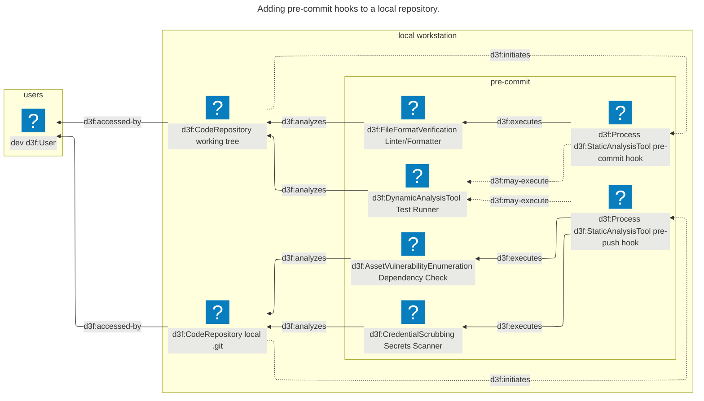

```mermaid
---
title: Adding pre-commit hooks to a local repository.
config:
  layout: elk
---
graph RL

subgraph users
  dev((dev d3f:User))@{icon: "d3f:User"}
end

worktree --->|d3f:accessed-by| dev
repo --->|d3f:accessed-by| dev

subgraph local["local workstation"]
  %% Security subjects.
  repo["d3f:CodeRepository local .git"]@{icon: "d3f:CodeRepository"}
  worktree["d3f:CodeRepository working tree"]@{icon: "d3f:CodeRepository"}

  worktree -.->|d3f:initiates| hook
  subgraph pre-commit
    %% d3f:DefensiveTechnique
    hook["d3f:Process d3f:StaticAnalysisTool pre-commit hook"]@{icon: "d3f:StaticAnalysisTool"}
    hook-push["d3f:Process d3f:StaticAnalysisTool pre-push hook"]@{icon: "d3f:StaticAnalysisTool"}


    %% pre-commit
    hook -->|d3f:executes| linter

    %% Balance the speed and accuracy, e.g. use different checks in pre-commit and pre-push hooks.
    %% pre-push
    linter["d3f:FileFormatVerification Linter/Formatter"]@{  icon: "d3f:FileFormatVerification" }
    secrets@{label: "d3f:CredentialScrubbing Secrets Scanner", icon: "d3f:CredentialScrubbing"}
    deps@{label: "d3f:AssetVulnerabilityEnumeration Dependency Check", icon: "d3f:AssetVulnerabilityEnumeration"}
    tests@{label: "d3f:DynamicAnalysisTool Test Runner", icon: "d3f:DynamicAnalysisTool"}
  end

  hook-push -->|d3f:executes| secrets -->|d3f:analyzes| repo
  hook-push -->|d3f:executes| deps -->|d3f:analyzes| repo
  hook-push & hook -.->|d3f:may-execute| tests -->|d3f:analyzes| worktree

  linter -->|d3f:analyzes| worktree
  repo -.->|d3f:initiates| hook-push

end
```
