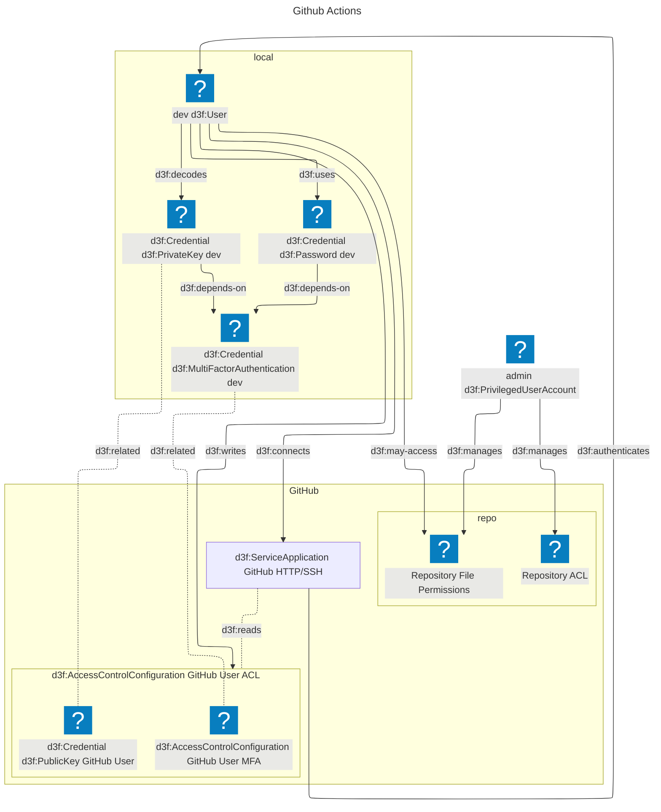

```mermaid
---
title: Github Actions
config:
  layout: elk
---
graph

subgraph local
    dev((dev d3f:User))@{icon: "d3f:User"}

    dev-pk[d3f:Credential d3f:PrivateKey dev]@{icon: "d3f:PrivateKey"}

    dev -->|d3f:decodes| dev-pk
    dev-password[d3f:Credential d3f:Password dev]@{icon: "d3f:Password"}

    dev -->|d3f:uses| dev-password
    dev-mfa-token[d3f:Credential d3f:MultiFactorAuthentication dev]@{icon: "d3f:MultiFactorAuthentication"}

    dev-password & dev-pk -->|d3f:depends-on| dev-mfa-token
end

subgraph gh["GitHub"]
  repo

  %% Git Services (http/ssh).
  gh-ssh[d3f:ServiceApplication GitHub HTTP/SSH]@{shape: process}


  subgraph gh-user-settings["d3f:AccessControlConfiguration GitHub User ACL"]

    gh-user-key[d3f:Credential d3f:PublicKey GitHub User]@{icon: "d3f:PublicKey"}
    gh-user-mfa[d3f:AccessControlConfiguration GitHub User MFA]@{icon: "d3f:MultiFactorAuthentication"}
  end

end

subgraph repo
    repo-acl[Repository ACL]@{icon: "d3f:AccessControlConfiguration"}
    repo-file-permissions[Repository File Permissions]@{icon: "d3f:AccessControlConfiguration"}
end

%% User configure its personal access control settings in GitHub, e.g. public key and MFA.
dev-pk -.-|d3f:related| gh-user-key
dev-mfa-token -.-|d3f:related| gh-user-mfa

dev -->|d3f:writes| gh-user-settings
dev -->|d3f:connects| gh-ssh

gh-ssh -->|d3f:authenticates| dev
gh-ssh -.-|d3f:reads| gh-user-settings


%% Admin configures user privilegs.
admin((admin d3f:PrivilegedUserAccount))@{icon: "d3f:PrivilegedUserAccount"}
admin -->|d3f:manages| repo-acl
admin -->|d3f:manages| repo-file-permissions
dev -->|d3f:may-access| repo-file-permissions
```
